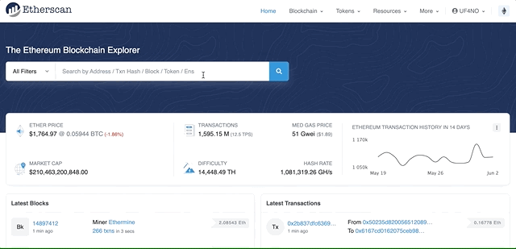

# The ultimate guide to token balances

Checking different token balances is a common task and something pretty simple to do. You just need to open your wallet and it'll automatically check the balances of all the tokens you've imported. But what happens if you own an amount of tokens that you have not imported in your wallet? and what if you want to check the balance of someone else's wallet? And what if you want to check your balances in a specific date?

In this article we're going to show you different methods to check balances of any wallet, in multiple blockchain protocols, at any point in time and we'll even give you a tool that you can run to make it even easier.

## How to obtain token balance

**All ERC20 tokens have a `balanceOf` method that returns the balance of a given wallet address.** This method is public so anyone can use it, you just need the ERC20 token contract address, the wallet address you want to query the balance from, and access to a blockchain node to run the query.

So first of all, to get access to multple blockchains nodes:

[Sign up with Chainstack](https://console.chainstack.com/user/account/create)
[Deploy a node](https://docs.chainstack.com/platform/join-a-public-network)
[Get the node RPC endpoints](https://docs.chainstack.com/platform/view-node-access-and-credentials)

### Obtain a token address and ERC20 token list

We can find the address of the ERC20 token we want to check from the project documentation. For common tokens like USDC, you go to any explorer like etherscan, enter the name and it'll pop-up.



If we want to get multiple token balances, the first thing we need is a list of tokens. One option is to manually create a file with the contract address of all the ERC20 tokens we want to check. This option is ok if we want to check just a few tokens, but if we want to check the balances across tens of different tokens, manually creating a file would be a tedious task. So how can we get a list of all tokens?

[TokenLists.org] is a good option for Ethereum, but if we want to query different blockchain protocols, we need more lists. Luckily for us, this is something a lot of people are working one and I found [this repository](https://github.com/viaprotocol/tokenlists/tree/main/tokenlists) with lists of ERC20 tokens for a lot of different blockchains like Avalache, BNB, Polygon, etc.

We can download the JSON files direcly from the repository manually or in a script file like this:

```js
// using axios for the request
const axios = require('axios')

const TOKEN_LISTS = {
  Ethereum:
    'https://raw.githubusercontent.com/viaprotocol/tokenlists/main/tokenlists/ethereum.json',
  Avalanche:
    'https://raw.githubusercontent.com/viaprotocol/tokenlists/main/tokenlists/avax.json',
  Binance:
    'https://raw.githubusercontent.com/viaprotocol/tokenlists/main/tokenlists/bsc.json',
}

/**
 * @param chain string with the protol name. eg Avalanche
 */
const getTokens = async (chain) => {
  // get token list URL from constants file by chain
  const tokenSource = TOKEN_LISTS[chain]
  // retrieve token list from URL
  const res = await axios.get(tokenSource)
  // return list of tokens
  return res.data
}
```

### Current balance vs past balance

It's important to note that you can obtain the **current balance from a blockchain full node**, but in order to get balances from **past dates (or 128 blocks before the current one in most cases) you'd need access to an archive node.**

You can get access to both types of nodes in Chainstack, just make sure you are using the correct one to avoid getting errors.

If you want to read more about the differences between full and archive nodes, check out [this article](https://chainstack.com/evm-nodes-a-dive-into-the-full-vs-archive-mode/).

To obtain the current balance we'd need to pass the wallet address to the `balanceOf` method of the ERC20 contract instance:

```js
/**
 *
 * @param {*} token object with address, name and symbol
 * @param {*} wallet address to query
 * @returns
 */
const getSingleTokenBalance = async (token, wallet) => {
  const contract = new ethers.Contract(token.address, ERC20_ABI, provider)

  const res = await contract.balanceOf(wallet)

  return res
}
```

However if we want to obtain the balance from a previous date, we'd need to include the `blockTag` flag, which receives the block number from which we want to query.

```js
/**
 *
 * @param {*} token object with address, name and symbol
 * @param {*} wallet address to query
 * @param {*} block  block number
 * @returns
 */
const getSingleTokenBalanceByBlock = async (token, wallet, block) => {
  const contract = new ethers.Contract(token.address, ERC20_ABI, provider)

  // adds the blockTag flag to query past balances
  const res = await contract.balanceOf(wallet, {
    blockTag: +block,
  })

  return res
}
```

The problem here is, how do we find the block number of a specific date? Let's dig into that

### Getting the block number for a date

Obtaining the block number at any given date is the ticky part. For Ethereum, there is the [ethereum-block-by-date](https://www.npmjs.com/package/ethereum-block-by-date) NPM package but for other chains, I haven't found anything similar.

However, most chains have an explorer based on [etherscan](https://etherscan.io), for example there is [Snowtrace](https://snowtrace.io) for Avalanche and [BscScan](https://bscscan.com) for Binance Smart Chain. All these explorers have a public API with a method to get the block number by timestamp. You can find [the documentation here](https://docs.etherscan.io/api-endpoints/blocks).

We just need to send a request to the API method passing a Unix timestamp and our own API key.

```js
const axios = require('axios')

// API base URL
const ETHERSCAN_API = 'https://api.etherscan.io/api'
// API key loaded from environment variable
const ETHERSCAN_API_KEY = process.env.API_KEY
/**
 * @param {*} dateFrom JS Date to query from
 * @returns  the block number
 * */
const getBlockByTimestamp = async (dateFrom) => {
  // generate Unix timestamp from JS date
  const timestamp = Math.floor(new Date(dateFrom).getTime() / 1000)
  // API endpoint from docs
  const queryParams = `?module=block&action=getblocknobytime&timestamp=${timestamp}&closest=before&apikey=${ETHERSCAN_API_KEY}`

  const endpoint = `${baseURL}${queryParams}`
  // send requests using axios
  const res = await axios.get(endpoint)
  // reponse received in data.result
  return res.data.result
}
```

## Getting querying multiple tokens simultaniously

## CLI tool? web app?

Options:

- current
- 30 days ago (with 6125 block per day aprox)
- 180 days ago (with 6125 block per day aprox)
- specific block number
