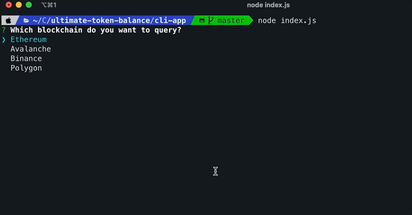

# The ultimate guide to ERC20 token balances

Checking different token balances is a common task and something pretty simple to do. You just need to open your wallet and it'll automatically check the balances of all the tokens you've imported. But what happens if you own some tokens that you have not imported into your wallet? What if you want to check the balance of someone else's wallet? And what if you want to check your balances on a specific date?

In this article, we're going to show you everything you need to know about **how to check token balances for any wallet, in multiple blockchain protocols, at any point in time.** In addition, we'll provide a command-line tool that you can run locally to make things even easier.

Let's jump into it

## How to obtain a token balance

**All ERC20 tokens have a `balanceOf` method that returns the balance of a given wallet address.** This method is public so anyone can use it, you just need the ERC20 token contract address, the wallet you want to query the balance from, and access to a blockchain node to run the query.

So first of all, to get access to multiple blockchains nodes:

[Sign up with Chainstack](https://console.chainstack.com/user/account/create)
[Deploy a node](https://docs.chainstack.com/platform/join-a-public-network)
[Get the node RPC endpoints](https://docs.chainstack.com/platform/view-node-access-and-credentials)

### Getting an ERC20 token address

We can find the address of the ERC20 token we want to check from the project documentation. For common tokens like USDC, you can go to any explorer like etherscan, enter the name and it'll pop up.


If we want to get the balance from multiple tokens, the first thing we need is a list of all of them. One option is to manually create a file with the contract address of all the ERC20 tokens we want to check. This option is ok if we want to check just a few tokens, but if we want to check the balances across tens of different tokens, manually creating a file would be a tedious task. So **how can we get a list of all ERC20 tokens?**

### Getting a list of ERC20 tokens

[TokenLists.org](https://tokenlists.org) is a good option for Ethereum, but if we want to query different blockchain protocols, we need more lists. Luckily for us, this is something a lot of people are working on and I found **[this repository](https://github.com/viaprotocol/tokenlists/tree/main/tokenlists) with lists of ERC20 tokens for a lot of different blockchains like Avalanche, BNB, Polygon, etc.**

We can manually download the JSON files directly from the repository or, download them with Javascript. In the example below I created a function that receives the name of the blockchain we want to get the token list for, and it downloads it from the correspondent URL:

```js
// using axios for the request
const axios = require('axios')

const TOKEN_LISTS = {
  Ethereum:
    'https://raw.githubusercontent.com/viaprotocol/tokenlists/main/tokenlists/ethereum.json',
  Avalanche:
    'https://raw.githubusercontent.com/viaprotocol/tokenlists/main/tokenlists/avax.json',
  Binance:
    'https://raw.githubusercontent.com/viaprotocol/tokenlists/main/tokenlists/bsc.json',
  Polygon:
    'https://raw.githubusercontent.com/viaprotocol/tokenlists/main/tokenlists/polygon.json',
}

/**
 * @param chain string with the protocol name. eg Avalanche
 */
const getTokens = async (chain) => {
  // get token list file URL by chain
  const tokenSource = TOKEN_LISTS[chain]
  // retrieve token list from URL
  const res = await axios.get(tokenSource)
  // return list of tokens
  return res.data
}
```

### Current balance vs past balance

To obtain the current balance we'd need to call the `balanceOf` method of the ERC20 contract instance and pass the wallet address we want to query from:

```js
/**
 * Gets current balance
 * @param {*} token object with address, name and symbol
 * @param {*} wallet address to query
 * @returns
 */
const getSingleTokenBalance = async (token, wallet) => {
  const contract = new ethers.Contract(token.address, ERC20_ABI, provider)

  const res = await contract.balanceOf(wallet)

  return res
}
```

However, if we want to obtain the balance from a previous date, we'd need to include the `blockTag` flag, which receives the block number from which we want to query.

```js
/**
 * Gets balance at a given block
 * @param {*} token object with address, name and symbol
 * @param {*} wallet address to query
 * @param {*} block  block number
 * @returns
 */
const getSingleTokenBalanceByBlock = async (token, wallet, block) => {
  const contract = new ethers.Contract(token.address, ERC20_ABI, provider)

  // adds the blockTag flag to query past balances
  const res = await contract.balanceOf(wallet, {
    blockTag: +block,
  })

  return res
}
```

It's important to note that you can obtain the **current balance from a blockchain full node**, but in order to get balances from **past dates (or 128 blocks before the current one in most cases), you'd need access to an archive node.**

You can get access to both types of nodes in Chainstack, just make sure you are using the correct one to avoid getting errors. And if you want to read more about the differences between full and archive nodes, check out [this article](https://chainstack.com/evm-nodes-a-dive-into-the-full-vs-archive-mode/).

The problem here is, how do we find the block number of a specific date? Let's dig into that

### Getting the block number for a past date

Obtaining the block number at any given date is the tricky part. For Ethereum, there is the [ethereum-block-by-date](https://www.npmjs.com/package/ethereum-block-by-date) NPM package but for other chains, I haven't found anything similar.

However, most chains have an explorer based on [etherscan](https://etherscan.io), for example, there is [Snowtrace](https://snowtrace.io) for Avalanche and [BscScan](https://bscscan.com) for BNB Chain. All these explorers have a public API with a method named `getblocknobytime` that returns the block number at a given timestamp. You can find [the documentation here](https://docs.etherscan.io/api-endpoints/blocks).

So to get the block number from a specific date, we just need to send a request to the API method passing a Unix timestamp and our API key.

```js
const axios = require('axios')

// API base URL
const ETHERSCAN_API = 'https://api.etherscan.io/api'
// API key loaded from environment variable
const ETHERSCAN_API_KEY = process.env.API_KEY
/**
 * @param {*} dateFrom JS Date to query from
 * @returns  the block number
 * */
const getBlockByTimestamp = async (dateFrom) => {
  // generate Unix timestamp from JS date
  const timestamp = Math.floor(new Date(dateFrom).getTime() / 1000)
  // API endpoint from docs
  const queryParams = `?module=block&action=getblocknobytime&timestamp=${timestamp}&closest=before&apikey=${ETHERSCAN_API_KEY}`

  const endpoint = `${baseURL}${queryParams}`
  // send requests using axios
  const res = await axios.get(endpoint)
  // reponse received in data.result
  return res.data.result
}
```

### Getting multiple token balances simultaneously

Once we have a list of tokens, we can loop through it and call the `balanceOf` method for each token to get a list of all token balances, however, waiting for each request to finish before sending the next one can take a lot of time. For example, the Ethereum token list has more than 1200 different tokens so it'll take a while to send all the requests one after the other.

Using `Promise.allSettle()` we can loop through the list of tokens and create all the requests, but instead of waiting for each one, we can send them all simultaneously:

```js
/**
 * Loops through a token list to retrieve balances for a given wallet
 * @param {*} tokenList array of tokens with address, symbol, decimals and name
 * @param {*} wallet address to query balance from
 * @param {*} block block number to query past balances
 * @returns Array of balances
 */
const getAllTokenBalances = async (tokenList, wallet, block) => {
  // array to store all balance requests
  let proms = []
  // array to store balances
  let results = []

  for (const tkn of tokenList) {
    // create ERC20 token contract instance
    const erc20 = new ethers.Contract(tkn.address, ERC20_ABI, provider)
    // save request in array of Promises
    proms.push(
      erc20.balanceOf(wallet, {
        blockTag: +block,
      })
    )
  }
  // actually requests all balances simultaneously
  const promiseResults = await Promise.allSettled(proms)

  // loop through all responses to format response
  for (let index = 0; index < promiseResults.length; index++) {
    // transforms balance to decimal
    const bal = convertToNumber(
      promiseResults[index].value,
      tokenList[index].decimals
    )
    // save balance with token name and symbol
    results.push({
      name: tokenList[index].name,
      symbol: tokenList[index].symbol,
      balance: bal,
    })
  }

  return results
}
```

Note that we're storing all the request responses in `promiseResults` and then looping through it to format the balance as a decimal and save it with the token name and symbol.

## How to obtain token details: name, symbol and decimals

All the **token properties like name and the number of decimals, can be retrieved from the contract itself** using the `name` or `decimals` methods. Here is a function that retrieves the name, symbol and number of decimals for a given token:

```js
const { ethers } = require('ethers')

const provider = new ethers.providers.JsonRpcProvider(
  `https://chainstack-node-endpoint/123456`
)
/**
 * @param {*} address address of the ERC20 token contract
 * @returns object with name, decimals and symbol of the token
 */
const getTokenDetails = async (address) => {
  const contract = new ethers.Contract(address, ERC20_ABI, provider)

  console.log(`Retrieving ERC20 token details...`)
  const decimals = await contract.decimals()
  const name = await contract.name()
  const symbol = await contract.symbol()

  return { name, decimals, symbol }
}
```

## How to format token balance to decimal

The `balanceOf` method of the ERC20 token contract returns the **balance as a BigNumber in hexadecimal format** and converting it to string will not separate the decimals for us.

For example if we have 15USDC, the reponse will be this:

```js
// wallet with 15USDC
const balanceBN = await contract.balanceOf(wallet)
// balanceBN will be BigNumber { _hex: '0xe4e1c0' }
const balanceStr = balanceBN.toString()
// balanceStr will be "15000000"
```

In order to format this into a number with decimals, we can use `ether.utils.formatUnits`, which receives the original value and the number of decimals. Most ERC20 tokens use 18 decimals by default but not all of them, like USDC which uses 6 decimals.

```js
/**
 *
 * @param {*} hex the original value in hex format
 * @param {*} decimals the number of decimals used by the token, default 18
 * @returns
 */
const convertToNumber = (hex, decimals = 18) => {
  if (!hex) return 0
  console.log(`Converting to number ${hex} with ${decimals} decimals`)

  return ethers.utils.formatUnits(hex, decimals)
}
```

## Token balances CLI tool

In [the following repository](https://github.com/chainstack/token-balance-ultimate), you can find a CLI tool that simplifies the whole process of checking token balances.

To run it locally you'd need to [get access to blockchain nodes](https://console.chainstack.com/user/account/create), get your API keys from [Etherscan](https://etherscan.io/), [Snowtrace](https://snowtrace.io/), [BscScan](https://bscscan.com/) and [PolygonScan](https://polygonscan.com/) and configure them in the .env file.



You can find all the instructions to configure and run the application [in the repository](https://github.com/chainstack/token-balance-ultimate).

## Conclusion

In this article, we've reviewed all the little intricacies that could arise when dealing with token balances. From finding a token contract to getting a list of all the tokens in a protocol, and formatting the response with decimals.

Getting past balances can be very tricky because we need to find the block number for a specific date but we can make things easier by leveraging APIs from the different blockchain explorers.

Make sure to clone the repo with our token balance CLI tool and give it a try!
