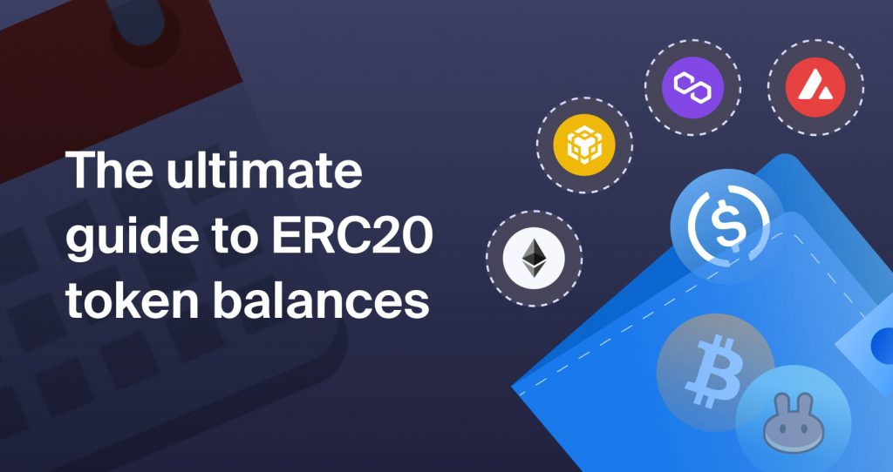

# The ultimate guide to token balances



This repository contains code examples to obtain balances from multiple ERC20 tokens for a blockchain wallet.

Check out [the article in the Chainstack blog](https://chainstack.com/ultimate-guide-erc20-token-balance/) for a complete description of how to query balances.

## CLI app

The cli-app folder contains an app that can be used to query token balances from different blockchain protocols from the command line. Supported blockchains are: Ethereum, Binance Smart Chain, Avalanche and Polygon.

### CLI app requirements

**This application requires Node.js v15**

This app requires access to blockchain archive nodes via RPC. [Sign up with Chainstack](https://console.chainstack.com/user/account/create) to get access to multiple blockchain protocols.

In addition, it uses the APIs from [Etherscan](https://etherscan.io/), [Snowtrace](https://snowtrace.io/), [BscScan](https://bscscan.com/) and [PolygonScan](https://polygonscan.com/) so API keys for all those are also requred.

> Note: not all API keys are mandatory, just the ones from the blockchain protocol you'd use.

Both archive nodes endpoints and API keys must be configured in an .env file. Just enter the values in the `.env.example` file and rename it to `.env`.

```sh
ETH_ARCHIVE_NODE=
BNB_ARCHIVE_NODE=
AVA_ARCHIVE_NODE=
POLY_ARCHIVE_NODE=
ETHERSCAN_API_KEY=
SNOWTRACE_API_KEY=
BSCSCAN_API_KEY=
POLYSCAN_API_KEY=

```

### Installation and run

Install all dependencies with `npm i`. Start the CLI program with `node index.js`
